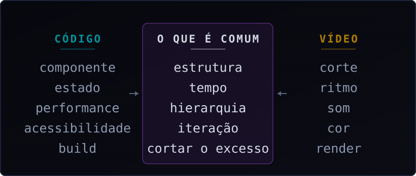
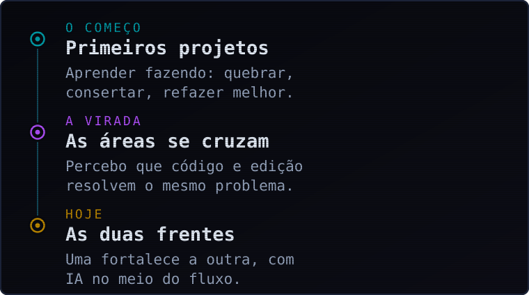

<div align="center">


</div>

Trabalho na interseção entre **desenvolvimento web** e **edição de vídeo**. As duas áreas
operam sobre os mesmos dois materiais — estrutura e tempo — e quase tudo que aprendo numa
transfere para a outra. Um componente e um corte respondem à mesma pergunta: o que fica,
em que ordem, e por quanto tempo.

Nos últimos anos passei a usar modelos de linguagem no meio do fluxo, não no fim dele. O
que me interessa aí não é gerar resultado pronto, é encurtar a distância entre ter a ideia
e conseguir olhar para ela.

```
┌── FICHA ───────────────────────────────────────────────┐
│                                                        │
│  nome ......... Alex Martins                           │
│  áreas ........ web · vídeo · automação                │
│  base ......... Brasil · pt-BR                         │
│  materiais .... estrutura e tempo                      │
│  método ....... quebrar, consertar, refazer melhor     │
│  contato ...... alexsandermmj@gmail.com                │
│                                                        │
└────────────────────────────────────────────────────────┘
```

---

## // ÁREAS DE INTERESSE

- **Interfaces de alta performance no navegador** — o que o usuário sente como "rápido" é
  quase sempre uma decisão de arquitetura, não de otimização tardia.
- **Simulação e visualização 3D em tempo real** — escala, física e o problema de representar
  ordens de grandeza que não cabem numa tela.
- **Ritmo e retenção em vídeo curto** — onde cortar, quanto segurar, e por que a atenção cai.
- **Automação de fluxo com LLM** — o que vale automatizar, o que não vale, e como manter a
  decisão criativa com a pessoa.
- **Acessibilidade e responsividade como restrição de projeto** — não como acabamento.

---

## // A INTERSEÇÃO

A hipótese que organiza meu trabalho: código e edição não são dois ofícios que eu acumulo,
são o mesmo problema apresentado em dois materiais. O que muda é o suporte.



Na prática isso significa levar hierarquia visual do vídeo para a interface, e disciplina
de iteração da interface para a timeline.

---

## // TRAJETÓRIA



Não cheguei aqui por um plano. Comecei pelo código, entrei em vídeo por necessidade de
projeto, e demorei a perceber que as duas coisas estavam se ensinando mutuamente.

---

## // DISTRIBUIÇÃO DE FOCO

Como o tempo se reparte hoje entre as quatro frentes. A proporção não é fixa — muda com o
projeto —, mas a ordem tem sido estável.


<!-- ┌──────────────────────────────────────────────────────────────────────────┐
     │  Seção ATIVIDADE — desligada por decisão, não por falta de dado.        │
     │  O `atividade.svg` já está gerado com dado real da API do GitHub.       │
     │  Está fora porque a conta é nova (ago/2025, 3 repos): o gráfico mostra  │
     │  8 meses zerados e 98% HTML — e esse 98% é artefato de medição, já que  │
     │  o Three.js e o JS moram dentro de arquivos .html únicos.               │
     │  Pra ligar: `python gerar_visuais.py atividade` e apague este bloco.    │
     └──────────────────────────────────────────────────────────────────────────┘

---

## // ATIVIDADE


-->

---

## // INSTRUMENTAL


---

## // TRABALHO EM CURSO

### ◤ Explorador do Sistema Solar

Simulação 3D do sistema solar com física orbital. O problema central não é o render — é a
**escala**: as distâncias reais entre os planetas tornam qualquer visualização honesta
inutilizável. Resolvi com uma **escala orbital logarítmica**, que preserva a ordem e as
proporções relativas sem obrigar o usuário a atravessar o vazio.

Duas decisões que valem registro:

- **Modo infravermelho** — mapeia temperatura em falsa cor. Serve pra mostrar que a mesma
  cena carrega mais de uma camada de informação, e que escolher qual exibir já é uma leitura.
- **Bottom-sheet no celular** — a interface de controle não pode competir com a cena. No
  desktop ela cabe ao lado; no celular ela precisa sair da frente.

`Three.js` · `JavaScript` · `HTML/CSS`

**[ver rodando ›](https://pixelmartins.com)**

---

## // MÉTODO

Aprendo fazendo, e o ciclo é sempre o mesmo: **quebrar, consertar, refazer melhor**. É lento
no começo e fica rápido depois, porque o que sobra da terceira volta não é o resultado — é
saber onde aquilo costuma quebrar.

Duas consequências no dia a dia:

1. Escrevo a versão que funciona antes da versão que está certa, e só então decido se vale
   a diferença.
2. Prefiro uma restrição explícita a uma preferência implícita. Restrição se discute;
   preferência só aparece quando já está caro mudar.

---

<div align="center">

**[pixelmartins.com](https://pixelmartins.com)** ·
**[alexsandermmj@gmail.com](mailto:alexsandermmj@gmail.com)**

<br>

<sub>`//` *estrutura e tempo* `//`</sub>

</div>
