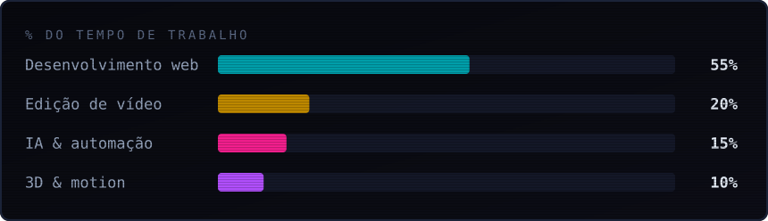
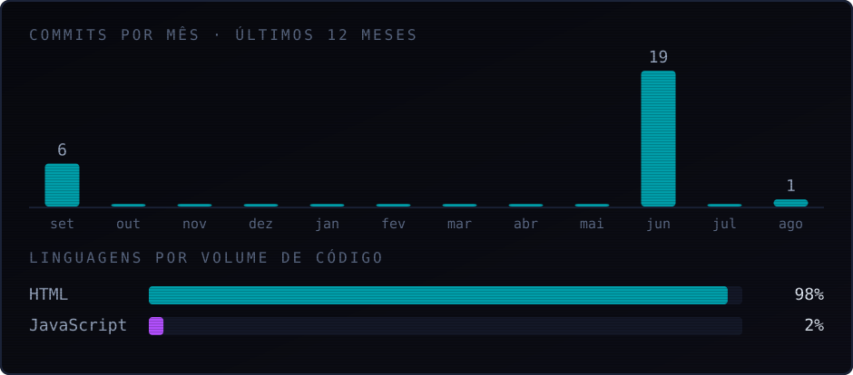
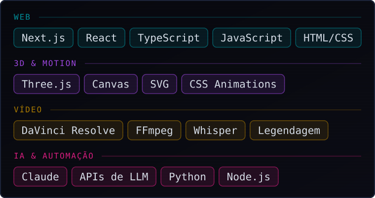

Trabalho na interseção entre **desenvolvimento web** e **edição de vídeo**. As duas áreas
operam sobre os mesmos dois materiais — estrutura e tempo — e quase tudo que aprendo numa
transfere para a outra. Um componente e um corte respondem à mesma pergunta: o que fica,
em que ordem, e por quanto tempo.

Nos últimos anos passei a usar modelos de linguagem no meio do fluxo, não no fim dele. O
que me interessa aí não é gerar resultado pronto, é encurtar a distância entre ter a ideia
e conseguir olhar para ela.

---

## // ÁREAS DE INTERESSE

- **Interfaces de alta performance no navegador** — o que o usuário sente como "rápido" é
  quase sempre uma decisão de arquitetura, não de otimização tardia.
- **Simulação e visualização 3D em tempo real** — escala, física e o problema de representar
  ordens de grandeza que não cabem numa tela.
- **Ritmo e retenção em vídeo curto** — onde cortar, quanto segurar, e por que a atenção cai.
- **Automação de fluxo com LLM** — o que vale automatizar, o que não vale, e como manter a
  decisão criativa com a pessoa.
- **Acessibilidade e responsividade como restrição de projeto** — não como acabamento.

---

## // DISTRIBUIÇÃO DE FOCO

Como o tempo se reparte hoje entre as quatro frentes. A proporção não é fixa — muda com o
projeto —, mas a ordem tem sido estável.

<!-- ┌──────────────────────────────────────────────────────────────────────────┐
     │  Seção ATIVIDADE — desligada por decisão, não por falta de dado.        │
     │  O `atividade.svg` já está gerado com dado real da API do GitHub.       │
     │  Está fora porque a conta é nova (ago/2025, 3 repos): o gráfico mostra  │
     │  8 meses zerados e 98% HTML — e esse 98% é artefato de medição, já que  │
     │  o Three.js e o JS moram dentro de arquivos .html únicos.               │
     │  Pra ligar: `python gerar_visuais.py atividade` e apague este bloco.    │
     └──────────────────────────────────────────────────────────────────────────┘

---

## // ATIVIDADE

-->

---

## // INSTRUMENTAL

---

## // TRABALHO

Tudo aqui **roda**: ou tem endereço para abrir agora, ou tem APK assinado para instalar.
Nenhum é maquete, e cada README diz o que **não** foi verificado.

---

### ◤ Explorador do Sistema Solar

Simulação 3D com física orbital. O problema central não é o render — é a **escala**: as
distâncias reais tornam qualquer visualização honesta inutilizável. Netuno está a 30 UA;
Mercúrio, a 0,39. Numa escala linear em que Mercúrio seja visível, o usuário passa a maior
parte do tempo atravessando vazio.

A saída é uma **escala orbital logarítmica**: preserva a ordem e a proporção relativa, e
descarta a distância absoluta. É uma troca consciente — a visualização passa a ser sobre a
estrutura do sistema, não sobre o tamanho dele.

- **Modo infravermelho** (acima) — a mesma cena, outra leitura. Vênus, que a olho nu é o
  segundo ponto mais discreto da tela, vira o corpo mais quente depois do Sol: 737 K, mais
  quente que Mercúrio, que está mais perto.
- **Modo vórtice** — o Sol se move a ~220 km/s em direção a Hércules, então nenhum planeta
  descreve elipse fechada: cada um traça uma espiral helicoidal.
- **100 corpos** catalogados, incluindo as luas grandes de Júpiter e Saturno e as sondas.

`Three.js` · `JavaScript` · arquivo único, sem build

**[ver rodando ›](https://skotalexsander.github.io/solarsys/)** ·
**[código ›](https://github.com/SkotAlexsander/solarsys)**

---

### ◤ Rotina

Agenda, tarefas e lembretes num app **local-first**: sem conta, sem servidor, e sem pedir
permissão de internet — ela nem está declarada no manifesto do Android.

  

O que eu não sabia antes de construir: **empacotar um PWA num APK não faz o lembrete tocar
com o aplicativo fechado.** Lá dentro ele continua sendo uma WebView, e WebView fechada não
acorda service worker — o APK ingênuo teria o mesmo alcance do navegador, com o agravante
de *parecer* que resolveu. Quem toca é o **AlarmManager do Android**, e o horário de
silêncio precisa ser aplicado no ato de agendar, porque o alarme do sistema não reavalia
nada: ele toca às 3 da manhã e acorda a pessoa.

A prova disso não é opinião: a bancada mata o aplicativo com `am force-stop` e confirma que
o alarme **continua registrado no sistema operacional**.

`React` · `TypeScript` · `Capacitor` · 408 testes de núcleo puro + 11 rodando dentro de um Android

**[baixar o APK ›](https://github.com/SkotAlexsander/rotina/releases/latest)** ·
**[código ›](https://github.com/SkotAlexsander/rotina)**

---

### ◤ E o resto

| | O que é, e o que era difícil |
|---|---|
| **[Vitrola](https://github.com/SkotAlexsander/vitrola)** [▶ abrir](https://skotalexsander.github.io/vitrola/) · [APK](https://github.com/SkotAlexsander/vitrola/releases/latest/download/Vitrola.apk) | Player de música que lê as etiquetas do arquivo, **tira a cor da capa** e tematiza a interface inteira com ela. O círculo parado virou toca-discos: prato que gira e para onde estava, braço que desce e caminha. Equalizador de 5 bandas, letra sincronizada, velocidade sem alterar o tom. |
| **[Acervo](https://github.com/SkotAlexsander/acervo)** roda no PC | Organizador dos arquivos do celular. O mesmo código roda no PC com uma **memória de celular simulada** e no Android mexendo nos arquivos de verdade. A tela de Limpeza separa o que é seguro recuperar do que **precisa da sua leitura** — é a distinção que separa liberar espaço de perder coisa. |
| **[Corpo](https://github.com/SkotAlexsander/corpo)** [▶ abrir e instalar](https://skotalexsander.github.io/corpo/) | Comida, água e treino. A meta de água vira **copos com horário**, e o plano não é guardado: é recalculado do que falta — por isso "agora não" redistribui sozinho. 165 alimentos com busca por apelido (miojo, refri, pf). |
| **[Come-Come](https://github.com/SkotAlexsander/come-come)** [▶ jogar](https://skotalexsander.github.io/come-come/) | Labirinto com 244 pastilhas — o número do fliperama — e **quatro fantasmas com alvo próprio cada**. A bancada carrega o jogo num DOM falso e joga sozinha: alcance de toda pastilha, 12 minutos ao acaso, ciclo comer→olhos→casa. |
| **[pixelmartins](https://github.com/SkotAlexsander/pixelmartins)** [▶ ver](https://skotalexsander.github.io/pixelmartins/) | O portfólio. Cinco páginas com endereço próprio, num arquivo só — dá para mandar o link de uma seção específica, e sem JavaScript as cinco aparecem em sequência. O fundo do tema escuro é poeira em três camadas que respondem ao ponteiro em profundidades diferentes, e o movimento é mola simulada, não curva: 2 KB de código no lugar dos 23 KB da biblioteca que faria o mesmo. |

**Vitrola** e **Central Pessoal** têm APK assinado para baixar. **Vitrola** e **Corpo**
também instalam na tela de início direto do navegador. Nenhum deles manda dado para lugar
nenhum — nem os que rodam no celular.

---

## // MÉTODO

Aprendo fazendo, e o ciclo é sempre o mesmo: **quebrar, consertar, refazer melhor**. É lento
no começo e fica rápido depois, porque o que sobra da terceira volta não é o resultado — é
saber onde aquilo costuma quebrar.

Duas consequências no dia a dia:

1. Escrevo a versão que funciona antes da versão que está certa, e só então decido se vale
   a diferença.
2. Prefiro uma restrição explícita a uma preferência implícita. Restrição se discute;
   preferência só aparece quando já está caro mudar.

---

**[pixelmartins](https://skotalexsander.github.io/pixelmartins/)** ·
**[alexsandermmj@gmail.com](mailto:alexsandermmj@gmail.com)**

`//` *estrutura e tempo*
